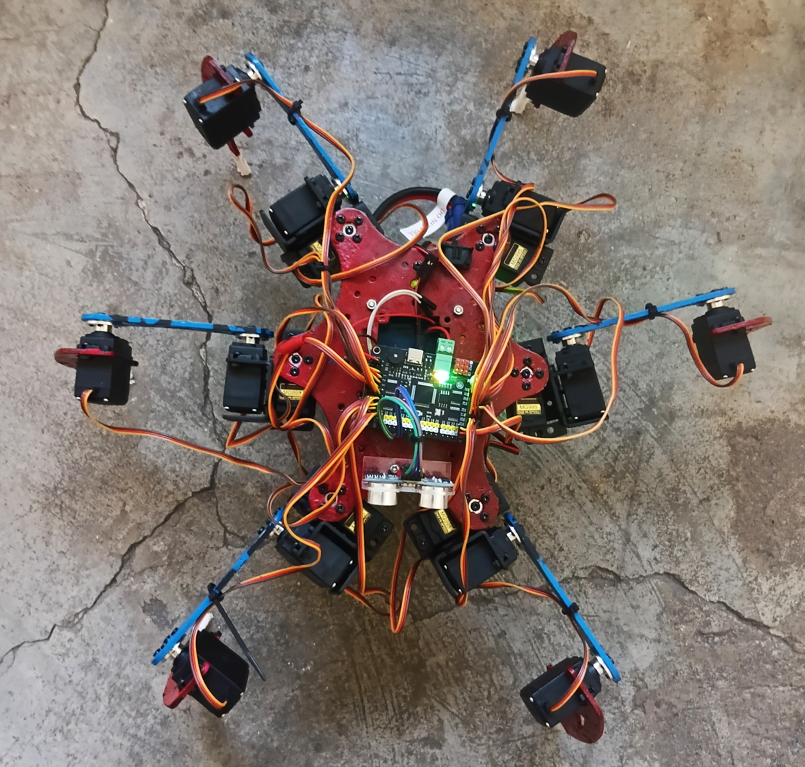
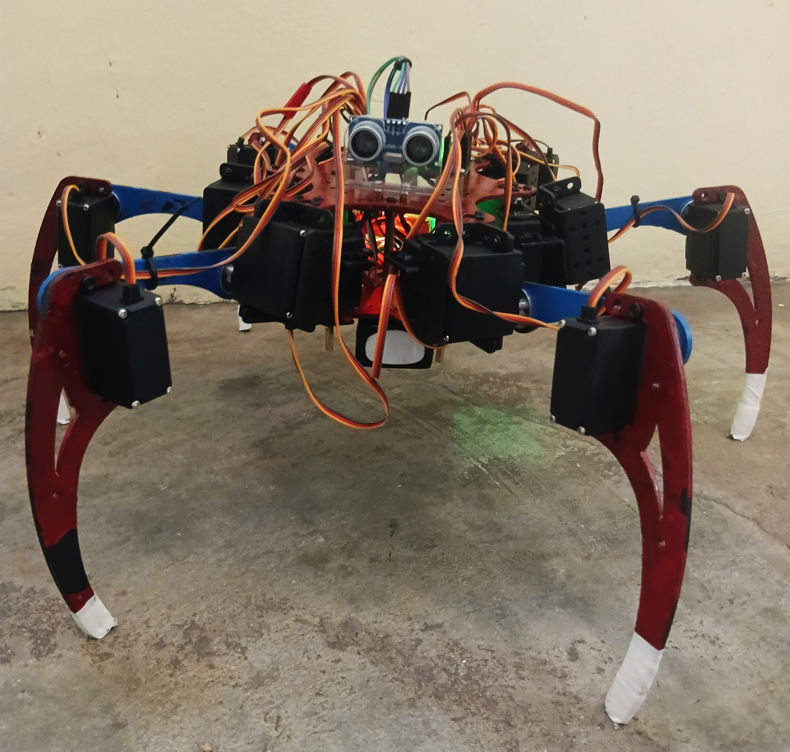

[](https://x.com/NorowaretaGemu)
[](https://opensource.org/licenses/MIT)
  
<br>
<div align="center">
  <a href="https://ko-fi.com/cursedentertainment">
    
  </a>
</div>
<div align="center">
  
</div>
<div align="center">
  
  
</div>
<div align="center">
  
</div>

# WHIP: Walking Hexapod Intelligence Platform

## Related Projects

- [KIDA-Robot-v00](https://github.com/CursedPrograms/KIDA-Robot-v00)
- [KIDA-Robot-v01](https://github.com/CursedPrograms/KIDA-Robot-v01)
- [NORA-Robot-v00](https://github.com/CursedPrograms/NORA-Robot-v00)
- [DREAM](https://github.com/CursedPrograms/DREAM)
- [RIFT](https://github.com/CursedPrograms/RIFT)

---

<div align="center">
  
</div>

---

## 📖 Overview

<details>
<summary><b>Overview</b></summary>

Utilizing high-torque servo control and real-time IMU feedback to navigate complex environments. By offloading leg kinematics to a dedicated servo controller, WHIP achieves fluid, insect-like motion while maintaining a low-latency connection for remote operations.

### Core Features
- [x] 18-DOF Kinematics: Full articulation for complex terrain adaptation and specialized gaits.
- [x] Adaptive Gait Selection: Real-time transitioning between Tripod, Wave, and Ripple gaits based on terrain.
- [x] IMU Stabilization: MPU6050 integration to prevent tipping and maintain Center of Gravity (CoG).

</details>

---

## Prerequisites

<details>
<summary><b>Prerequisites</b></summary>

### Software
- [Arduino IDE](https://docs.arduino.cc/software/ide/)

### Hardware

### Microcontrollers
| **Component** | **Details** |
|-----------|---------|
| Servo Controller | RTRobot Controller Board |
| Microcontroller | Arduino UNO |

### Chassis & Motion
| **Component** | **Details** |
|-----------|---------|
| Chassis | 18DOF hexapod chassis |
| Motors | 18 × MG995 180° Servo Motors |

### User Controllers
| **Component** | **Details** |
|-----------|---------|
| Interface | PC, Android, iPhone |
| Controller | PS2 Controller + Receiver |

### Power System
| **Component** | **Details** |
|-----------|---------|
| Battery | 3s LiPo |
| Voltage Regulator | UBEC (→ 6V) |

### Sensors
| **Component** | **Details** |
|-----------|---------|
| Ultrasonic Sensors | HC-SR04 |
| IMU SENSOR | MPU6050 |

</details>

---

<div align="center">
  
</div>

---

# Schematics
## ⚡ Technical Pinouts

<details>
<summary><b>View Power Distribution Wiring</b></summary>

### Power Schematic
```
3S LiPo ──────► UBEC 12.6V ──────► UBEC Output 6V
UBEC Output 6V:
├── + ──────► RTRobot Servo Controller Board +
├── – ──────► RTRobot Servo Controller Board - 
RTRobot Servo Controller Board + ──────► Arduino UNO +
RTRobot Servo Controller Board - ──────► Arduino UNO - 
```

</details>

> [!TIP]
> **Pro-Tip:** Be sure to set the UBEC output to 6V before connecting your components.

<details>
<summary><b>View RTRobot Servo Controller Configuration</b></summary>

**ARDUINO (DEV0):**
```
USB-C (DEV0) ──────► USB-C (DEV1) - Serial Communication
```
#### Libraries:
```
- Wire.h
- Adafruit_PWMServoDriver.h
- PS2X_lib.h
```
```
POWER:
├── UBEC 6V ──────► 
└── GND ─────► Common GND (modules)

Leg 1 = Front  Left  → channels  0,  1,  2
Leg 2 = Middle Left  → channels  3,  4,  5
Leg 3 = Back   Left  → channels  6,  7,  8
Leg 4 = Front  Right → channels  9, 10, 11
Leg 5 = Middle Right → channels 12, 13, 14
Leg 6 = Back   Right → channels 15, 16, 17

PS2 Reciever Connection
```
</details>
<details>
<summary><b>View UNO Sensor Array Wiring</b></summary>

**ARDUINO (DEV1):**
```
USB-C (DEV1) ──────► USB-C (DEV0) - Serial Communication + Power
```
#### Libraries:
```
- Wire.h
- Adafruit_PWMServoDriver.h
- PS2X_lib.h
- MPU6050.h / I2Cdev.h
```
```
MPU6050 (Gyro + Accelerometer)
SDA  ─────► A4 (UNO)
SCL  ─────► A5 (UNO)

Ultrasonic Sensor (HC-SR04)
TRIG ─────► D7
ECHO ─────► D6

IRreciever ─────► D4
```
</details>
<details>
<summary><b>Sensor Wiring</b></summary>

#### Sensors
- MPU6050 (Gyro + Accelerometer)
```
VCC  ─────► 5V
GND  ─────► GND
SDA  ─────► SDA (UNO)
SCL  ─────► SCL (UNO)

```
- Ultrasonic Sensor (HC-SR04)
```
VCC  ─────► 5V
GND  ─────► GND
TRIG ─────► D7
ECHO ─────► D6
```
> [!TIP]
> **Pro-Tip:** Make sure all modules share a common ground (GND) for stable operation.

</details>

---
## 🌐 Connectivity & Controls

<details>
<summary><b>Connectivity & Controls</b></summary>

### Network Configuration
| Parameter | Value |
| :--- | :--- |
| **SSID** | `NORA` |
| **Password** | `12345678` |

### RIFT Integration
To connect via [RIFT](https://github.com/CursedPrograms/RIFT), ensure WHIP is active on:
* `localhost:5006`

</details>

---

<details>
<summary><b>View Gait Info</b></summary>
# Gaits

Because **WHIP** has 18-DOF, it can transition between these gaits depending on the speed required or the unevenness of the terrain detected by your **MPU6050**.

### 1. Tripod Gait (The "Standard")
This is the most common and fastest stable gait for hexapods.
* **Logic:** 3 legs move at once while the other 3 stay on the ground, forming a stable triangle (tripod).
* **Pattern:** `{L1, R2, L3}` move together, then `{R1, L2, R3}` move together.
* **Best For:** Fast movement on flat surfaces.

### 2. Wave Gait (The "Crawler")
The most stable but slowest gait.
* **Logic:** Only one leg moves at a time while the other 5 remain on the ground. The "wave" ripples from the back leg to the front.
* **Pattern:** `L3` → `L2` → `L1` → `R3` → `R2` → `R1`
* **Best For:** Maximum stability on extremely treacherous or unknown terrain.

### 3. Ripple Gait (The "Intermediate")
A middle ground between Wave and Tripod.
* **Logic:** Two legs move at a time, while four stay on the ground.
* **Pattern:** `{L3, R1}` → `{L2, R3}` → `{L1, R2}`
* **Best For:** Smooth, fluid motion at moderate speeds; looks the most "lifelike" or insect-like.

### 4. Quadruped-Style (Amble) Gait
* **Logic:** Two legs are lifted, but they are not opposite (unlike the Ripple).
* **Behavior:** It creates a slight "swaggering" motion. Often used if one side of the robot's motor driver is overheating and needs to distribute load differently.

---

## Specialized Gaits for 18-DOF Platforms

| Gait Name | Logic / Behavior | Use Case |
| :--- | :--- | :--- |
| **Metachronal** | A sequential wave that looks like a "Mexican Wave." | Moving through tight corridors. |
| **Rotational** | Legs move in a circular pattern around the center axis. | Turning 360° in place without changing the footprint. |
| **Sidewinding** | Lateral movement without changing the robot's heading. | Strafing to avoid an obstacle detected by the HC-SR04. |
| **Stair/Climb** | High-clearance lifting of the "Tibia" (lower leg). | Navigating steps or large debris. |

---

## 💡 The "Brain" Logic for Gaits
**Gait Selector** 

* **Default:** Tripod Gait (Speed).
* **Obstacle Detected (< 20cm):** Transition to Sidewind or Rotational.
* **Tilt Detected (> 10° via MPU6050):** Transition to Wave Gait (Safety/Stability).

> [!TIP]
> **Pro-Tip:** When programming these in `Adafruit_PWMServoDriver.h`, remember that "lifting" the leg (the Femur servo) must always be coordinated with "extending" the leg (the Coxa servo) to maintain the **Center of Gravity (CoG)**. If the CoG exits the tripod triangle, WHIP will tip!
</details>

---

### Hardware Configuration

## How to Run:
<details>
<summary><b>View How to Run</b></summary>

### Install Requirements

```bash
python -m venv venv
source venv/bin/activate
pip install -r requirements.txt
```
</details>
---

<br>
<div align="center">
© Cursed Entertainment 2026
</div>
<br>
<div align="center">
<a href="https://cursed-entertainment.itch.io/" target="_blank">
    
</a>
</div>
