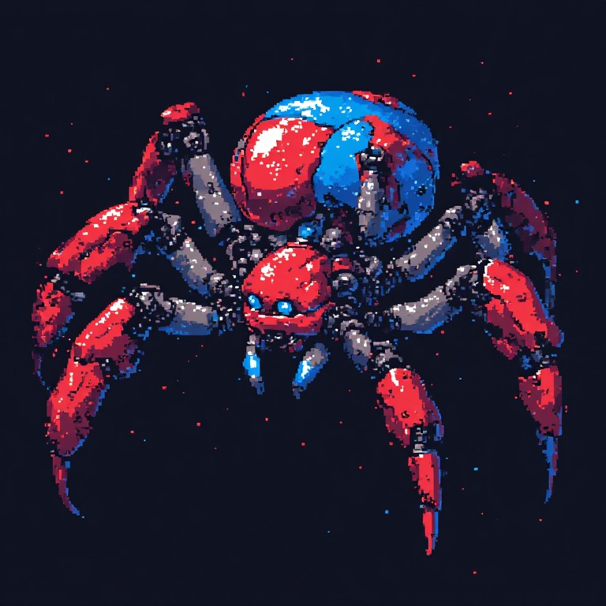
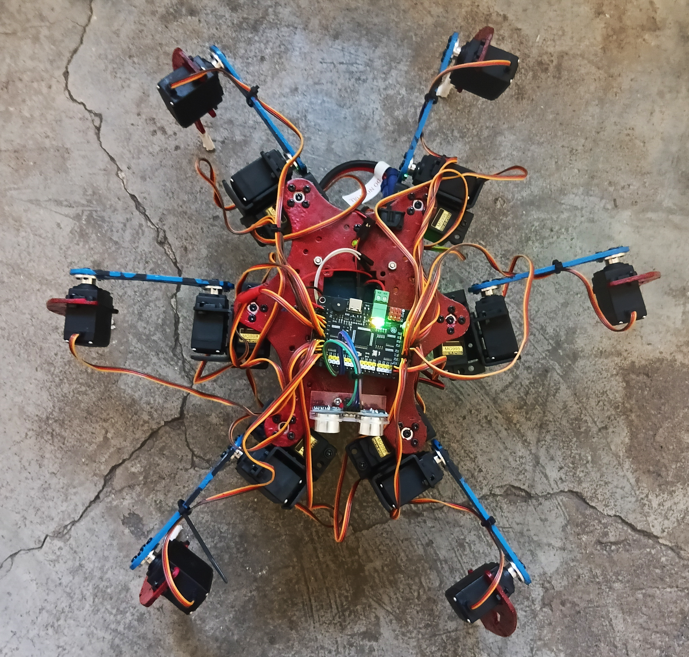
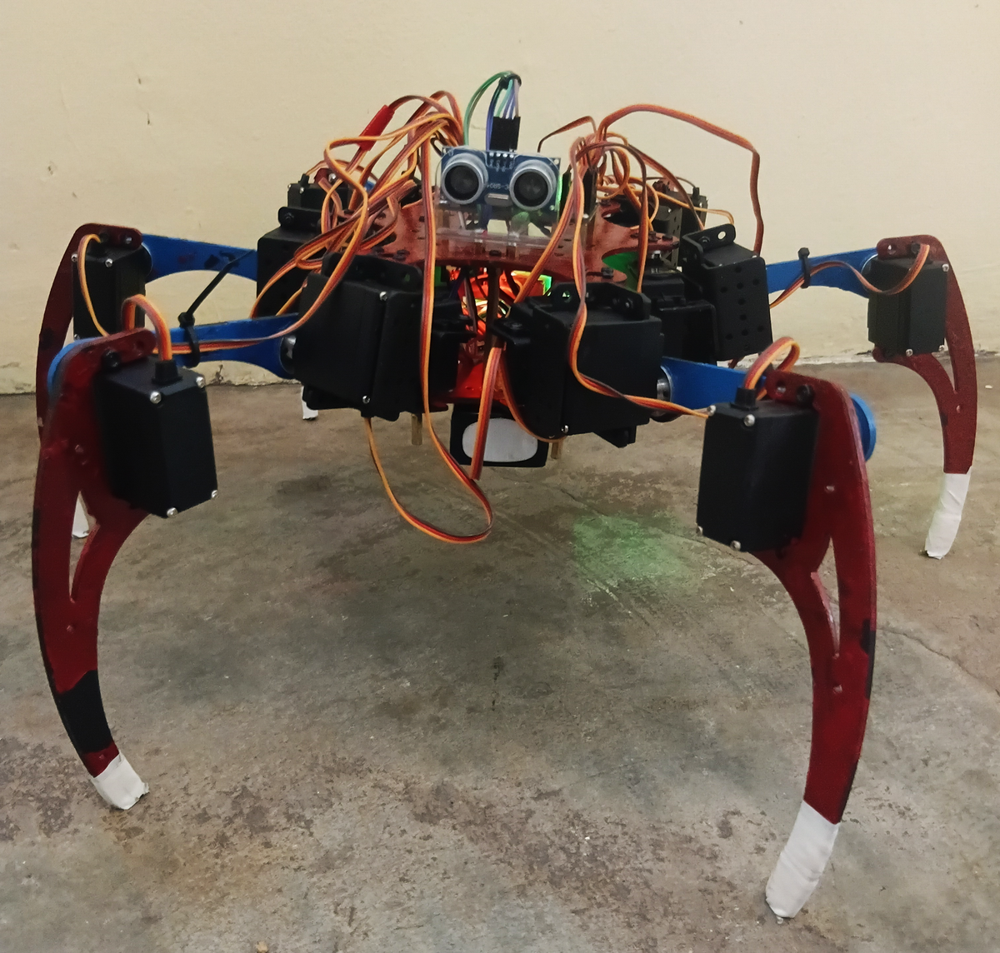
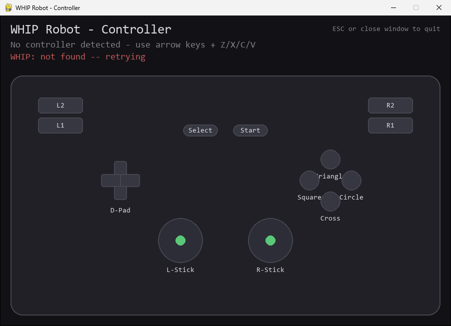

[](https://x.com/NorowaretaGemu)
[](https://opensource.org/licenses/MIT)
  
<br>
<div align="center">
  <a href="https://ko-fi.com/cursedentertainment">
    
  </a>
</div>
<div align="center">
  
</div>
<div align="center">
  
  
</div>
<div align="center">
  
</div>

# WHIP 
## Walking Hexapod Intelligence Platform

- Robot Type: Hexapod

<div align="center">
  
  <p><i>WHIP</i></p>
</div>

---

### Software
- [Arduino IDE](https://docs.arduino.cc/software/ide/)

---

## Related Projects

- [KIDA-Robot-v00](https://github.com/CursedPrograms/KIDA-Robot-v00)
- [KIDA-Robot-v01](https://github.com/CursedPrograms/KIDA-Robot-v01)
- [NORA-Robot-v00](https://github.com/CursedPrograms/NORA-Robot-v00)
- [DREAM](https://github.com/CursedPrograms/DREAM)
- [RIFT](https://github.com/CursedPrograms/RIFT)

---

<div align="center">
  
</div>

---

## 📖 Overview

<details>
<summary><b>Overview</b></summary>

WHIP is an 18-servo hexapod. An ESP32 runs the behaviour, WiFi and a browser control page, and streams pre-tuned gait poses to an RTrobot 32-channel servo controller, which moves all the joints together. An MPU6050 watches for tipping and an HC-SR04 watches the way ahead.

### Core Features
- [x] 18-DOF walking: forward, backward, turn left and turn right gaits, plus stand, rest and shut-down poses.
- [x] Three control modes: Obstacle Avoidance (the boot default), IR Remote, and Web (the browser page or the Python controller).
- [x] Tilt safety: past 10° of pitch or roll for 250 ms she stops and stands, and resumes once she is back under 7°.
- [x] Obstacle avoidance: walks until something is closer than 20 cm, then stands, turns and walks on once the way is clear past 35 cm.
- [x] Fleet: joins NORA's network when it's in range and registers with the fleet, or hosts her own `WHIP` access point.

</details>

---

## Prerequisites

<details>
<summary><b>Prerequisites</b></summary>

### Software
- [Arduino IDE](https://docs.arduino.cc/software/ide/) with the ESP32 board package
- Library: [`IRremote`](https://github.com/Arduino-IRremote/Arduino-IRremote) 4.x (`WiFi`, `WebServer`, `HTTPClient` and `Wire` come with the ESP32 core)
- Python 3 with `pygame` and `requests` for the desktop controller (`pip install -r requirements.txt`)

### Hardware

| **Component** | **Details** |
|-----------|---------|
| Microcontroller | ESP32 (the same module as NORA) |
| Servo controller | RTrobot 32-channel servo controller (UART, 38400 baud) |
| Chassis | 18-DOF hexapod chassis |
| Servos | 18 × MG995 180° |
| Battery | 3S LiPo |
| Regulator | UBEC set to 6 V |
| Distance | HC-SR04 ultrasonic sensor |
| Balance | MPU6050 gyro + accelerometer |
| Remote | NEC IR receiver + remote (the same remote as MILA and IDA) |
| Controllers | Browser, PS2-style USB gamepad (Python controller), IR remote |

Chassis Instruction Manual: https://1drv.ms/b/c/e7037d9b1b4cf216/EZ1ctC5zh_tOmuoInNRW6fgBGUFWBfHWW5chNCMn1rw6kQ?e=z3zNVd](https://1drv.ms/b/c/e7037d9b1b4cf216/EZ1ctC5zh_tOmuoInNRW6fgBGUFWBfHWW5chNCMn1rw6kQ?e=z3zNVd)

</details>

---

<div align="center">
  
</div>

---

# Schematics
## ⚡ Technical Pinouts

<details>
<summary><b>Power</b></summary>

```
3S LiPo ──────► UBEC (set to 6 V)
UBEC 6 V ─────► RTrobot servo controller V+ / GND   (servo power)
ESP32 ────────► USB or 5 V from the servo controller's logic rail
All grounds tied together
```

</details>

> [!TIP]
> Set the UBEC to 6 V **before** connecting the servos, and make sure every module shares a common ground.

<details>
<summary><b>ESP32 wiring</b></summary>

| Signal | ESP32 pin |
|---|---|
| Servo controller RX ← ESP32 TX | GPIO 1 (TX0) |
| Servo controller TX → ESP32 RX | GPIO 3 (RX0) |
| Debug console (optional USB-TTL) | GPIO 16 (RX2), GPIO 17 (TX2) |
| HC-SR04 TRIG / ECHO | GPIO 12 / GPIO 13 |
| MPU6050 SDA / SCL | GPIO 21 / GPIO 22 |
| IR receiver OUT | GPIO 14 |

The servo controller shares UART0 with the USB-serial bridge, exactly like NORA's ESP32↔Arduino link. **Disconnect the controller's wires before uploading**, then reconnect. Boot and status logging goes to Serial2 (GPIO 17) instead.

</details>

<details>
<summary><b>Servo channels</b></summary>

The gaits drive RTrobot channels **1–9** and **24–32** (18 servos, three per leg). Every pose and gait line comes from `gait.xml`, exported from the RTrobot editor.

`scripts/servo_setup/servo_setup.ino` sends every channel to 1500 µs (centre) for fitting the servo horns. It runs on an Arduino with the controller on SoftwareSerial pins 11 (RX) and 10 (TX) at 38400 baud.

</details>

---

## 🌐 Connectivity & Controls

<details>
<summary><b>Connectivity & Controls</b></summary>

### Network
On boot WHIP looks for NORA's access point. If it's there she joins it and registers with the fleet. If not, she starts her own.

| Parameter | Value |
| :--- | :--- |
| **NORA's network** | SSID `NORA`, password `12345678` |
| **WHIP's own AP** | SSID `WHIP`, password `12345678` |
| **Control page** | `http://<WHIP's IP>:5005/` |
| **Fleet registry** | `192.168.4.1:5000/register` (heartbeat every 10 s) |

### RIFT Integration
WHIP's control page is on port `5005`, the port [RIFT](https://github.com/CursedPrograms/RIFT) assigns her. On NORA's network she shows up in RIFT's Registered Fleet list.

### Control modes
| Mode | How | What it does |
|---|---|---|
| **Obstacle Avoidance** | IR `2`, web, gamepad Circle | Walks on her own and turns away from anything within 20 cm (boot default) |
| **IR Remote** | IR `1`, gamepad Square | Arrows walk and turn while held. She stands when you let go (350 ms timeout) |
| **Web** | Web page, gamepad Cross | D-pad on the page or the Python controller. She stands if the browser goes quiet for 500 ms |

### Driven by NORA (fleet IR link)
[NORA](https://github.com/CursedPrograms/NORA-Robot-v00) can drive WHIP through her IR transmitter, from her web page, Python controller or Bluetooth. The frames are Samsung-format IR at address `0x0DA3`, with the fleet link's commands: `0x48` forward, `0x49` back, `0x4A` left, `0x4B` right, `0x4C` stop, `0x4D` obstacle mode, `0x4E` manual, `0x4F` speed. Driving switches her into IR Remote mode, and each command runs as the matching remote button. She stands once the link has been quiet for 600 ms (frames can land mid-step). She has one gait speed, so `speed` is ignored. Link frames print as `LINK cmd=0x..`.

### Python controller (`scripts/controller.py`)
Draws a PS2-style pad and drives WHIP over WiFi. It finds her on NORA's network first, and on her own AP otherwise.

| Input | Action |
|---|---|
| D-pad / arrow keys | Forward, backward, turn left, turn right |
| Cross (A) | Web control mode (needed before driving) |
| Circle (B) | Obstacle Avoidance mode |
| Square (X) | IR Remote mode |
| Triangle (Y) | Emergency stop (stand) |

</details>

---

<details>
<summary><b>Gaits</b></summary>

### What the firmware does
| Movement | Lines | Source |
|---|---|---|
| Forward | 4 | `gait.xml` "Forward" group |
| Backward | 4 | `gait.xml` |
| Turn left / turn right | 5 each | `gait.xml` |
| Stand, rest, shut down | Poses | `gait.xml` "Reset - Shut Down" group |

Each line is sent with a move time of `GAIT_MOVE_MS` (300 ms). Retuning the walking speed is that one constant in `esp32.ino`.

### Gait reference
The patterns below are the design notes for future gaits. The current firmware walks with the tables above.

| Gait | Logic | Best for |
| :--- | :--- | :--- |
| **Tripod** | `{L1, R2, L3}` then `{R1, L2, R3}`: three legs move, three hold a triangle | Speed on flat ground |
| **Wave** | `L3 → L2 → L1 → R3 → R2 → R1`, one leg at a time | Maximum stability |
| **Ripple** | `{L3, R1} → {L2, R3} → {L1, R2}`, two legs at a time | Smooth, lifelike motion |
| **Amble** | Two non-opposite legs lifted together | Spreading load differently |
| **Metachronal** | A sequential "Mexican wave" | Tight corridors |
| **Rotational** | Legs circle the centre axis | Turning 360° in place |
| **Sidewinding** | Sideways without changing heading | Strafing round obstacles |
| **Stair / climb** | High tibia lift | Steps and debris |

> [!TIP]
> Lifting a leg (femur servo) must be coordinated with extending it (coxa servo) to keep the centre of gravity inside the support triangle, or WHIP will tip.

</details>

---

## How to Run:
<details>
<summary><b>View How to Run</b></summary>

1. Flash `scripts/esp32/esp32.ino` to the ESP32 (servo controller wires disconnected), then reconnect them.
2. Power WHIP. She stands, connects to NORA's network or starts her own `WHIP` AP, and starts in Obstacle Avoidance mode.
3. Open `http://<WHIP's IP>:5005/` in a browser, or run the Python controller:

```bash
python -m venv venv
source venv/bin/activate          # Windows: venv\Scripts\activate
pip install -r requirements.txt
python scripts/controller.py      # or ./scripts/launch_controller.sh
```
</details>

---

## 📡 Who's nearby (ESP-NOW + Bluetooth LE)

Every robot sends a small **"I'm here"** beacon twice a second and listens for the others'. From the **signal strength** it knows roughly how close each one is, and from how that changes over time whether it's **coming closer, steady or leaving**:

| Signal | Zone |
| :--- | :--- |
| above −45 dBm | very close |
| −45 to −60 dBm | near |
| −60 to −75 dBm | medium |
| below −75 dBm | far |

It's coarse (walls, bodies and antenna angle all change it): for "who's around", not distance. Precise collision avoidance stays with the ultrasonic and ToF sensors.

**They tell each other what they're doing**, because a rising signal looks the same from both sides even when only one robot moves. Over ESP-NOW they say it **in Brainfuck**, like the fleet's conversations: each beacon carries a program that prints `park`, `go`, `wait` or `hand` (a human is driving), and the receiver runs it. Bluetooth adverts are too small for a program, so BLE carries the same state as one byte.

**Who makes way**, in self-driving modes only:

| The other robot... | So this one... |
| :--- | :--- |
| is parked | is the one closing in: steers away |
| is yielding | carries on, carefully |
| is driven by a human | makes way (it's unpredictable) |
| drives itself | follows the alphabet: KIDA00, KIDA01, NORA, WHIP; everyone makes way for MILA, who can't hear the others |
| is leaving | carries on |

Making way = stop for 2 s, turn away, then drive on (and not yield again for 5 s, so two robots that stay close don't take turns forever). While another robot is near, or coming closer, it drives slower with wider margins.

WHIP hears the others over **ESP-NOW** (NORA, MILA) and **Bluetooth LE** (NORA, KIDA-00, KIDA-01). In **obstacle** mode she stands still and then turns away when a robot with right of way is close. `GET /near` shows her list. Code: `scripts/esp32/fleet_near.h` and `fleet_near_ble.h` (BLE adds a lot of code: she may need the *Huge APP* partition scheme).

---

## Screenshots

<div align="center">
  
</div>

<p align="center"><i>Python controller. Captured without a robot connected, so live values show their offline state.</i></p>

---

<br>
<div align="center">
© Cursed Entertainment 2026
</div>
<br>
<div align="center">
<a href="https://cursed-entertainment.itch.io/" target="_blank">
    
</a>
</div>
<br>
<div align="center">
  <a href="https://github.com/SynthWomb" target="_blank">
    
  </a>
</div>

---

<!-- DREAM-ECOSYSTEM:START -->
## The DREAM Robotics ecosystem

**Minds** — [DREAM](https://github.com/CursedPrograms/DREAM) companion · [TINA](https://github.com/CursedPrograms/TINA) engineer · [NINA](https://github.com/CursedPrograms/NINA) caretaker · [RIFT](https://github.com/CursedPrograms/RIFT) fleet hub · [LYCEA](https://github.com/CursedPrograms/LYCEA) training school  
**Robots** — [NORA](https://github.com/CursedPrograms/NORA-Robot-v00) · [MILA](https://github.com/CursedPrograms/MILA-Robot-v00) · [WHIP](https://github.com/CursedPrograms/WHIP-Robot-v00) · [KIDA-00](https://github.com/CursedPrograms/KIDA-Robot-v00) · [KIDA-01](https://github.com/CursedPrograms/KIDA-Robot-v01) · [IDA](https://github.com/CursedPrograms/IDA-Robot-v00) · [ARM](https://github.com/CursedPrograms/ARM-Robot-v01)  
**Tools** — [CRUSH](https://github.com/CursedPrograms/CRUSH) compression · [Image-Generator](https://github.com/CursedPrograms/Image-Generator) · [GloriosaAI](https://github.com/CursedPrograms/GloriosaAI) · [SynthWomb](https://github.com/CursedPrograms/SynthWomb) · [PyVitals](https://github.com/CursedPrograms/PyVitals)  
<!-- DREAM-ECOSYSTEM:END -->
